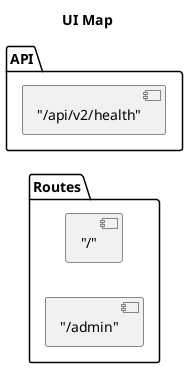

# Interface Architecture Mapping (UI ↔ API ↔ DB ↔ Permissions)

This project maintains a **lightweight, battle-tested** interface map so every screen/control/action ties back to code, data, and permissions—without drowning in documentation.

## Why this exists

If a feature can’t answer these questions, it isn’t “done”:
- Which UI route + control triggers it?
- Which backend handler executes it?
- Which tables/views/functions does it touch?
- What permission gate is required, and where is it enforced (UI/BE/DB)?
- What audit event and test prove it works?

## Deliverables (versioned in repo)

All generated/maintained artifacts live under `audit_artifacts/`:
- `ui_mapping_matrix.csv` (traceability matrix; CI-enforced)
- `ui-map.puml` (route + API overview diagram)
- `db_rls_report.md` (+ CSV exports of tables/policies/views)
- `policies_map.md` (route/control → permission keys + RLS notes)
- `data_contracts.md` (per-page reads/writes + states)

## Best approach (what to do, in order)

1. **UI inventory & taxonomy**: list all routes and key screens.
2. **Navigation graph with guards**: annotate each node with permission gates.
3. **Critical flows**: 2–3 short sequence diagrams (UI → API → DB → audit).
4. **Data contracts**: per page, document Loading / Empty / Error states.
5. **Permissions & RLS overlay**: ensure no “button with no backend power”.
6. **CI traceability**: fail PRs when new admin screens/actions aren’t mapped.

## Automation (regenerate artifacts)

From the repo root:

```bash
python3 scripts/generate_ui_map.py --repo-root .
python3 scripts/generate_db_rls_map.py --repo-root .
python3 scripts/check_traceability.py --repo-root .
```

## Templates

### `ui_mapping_matrix.csv` columns (traceability)

Minimum (CI-friendly) columns:

- `feature`
- `ui_route`
- `ui_component`
- `ui_ref` (file:line)
- `api_method`
- `api_path`
- `backend_ref` (file:line)
- `db_tables` (comma-separated)
- `permission_key` (RBAC/app permission)
- `rls_notes`
- `audit_event`
- `tests`
- `notes`

### PlantUML route map starter



