# UI Map (Frontend) — Routes, Pages, Guards

This document inventories the current frontend navigation in `frontend/src/App.jsx` and summarizes *where* access control is enforced.

> **Important:** The router now wraps *some* routes with an explicit guard component (`RequireRole`). Other routes still rely on component-level checks.

## Route inventory

| Route | Component | Guard (as implemented today) |
| --- | --- | --- |
| `/` | `Dashboard` | Authenticated user (router-level) |
| `/reset-password` | `ResetPassword` | Authenticated user (router-level); also supports recovery flow |
| `/eom/nominate` | `EOMNomination` | Router-level `RequireRole(['department_head'])` |
| `/eom/vote` | `EOMNomination (mode="vote")` | Router-level `RequireRole(['department_head'])` |
| `/eom/hall-of-fame` | `EOMHallOfFame` | Component-level (no explicit role guard today) |
| `/eom/diversity` | `EOMDiversityDashboard` | Component-level (no explicit role guard today) |
| `/eom/feedback` | `EOMFeedbackForm` | Component-level (authenticated user expected) |
| `/mre/evaluate` | `MREEvaluation` | Component-level |
| `/admin/cycles` | `CycleManagement` | Router-level `RequireRole(['pnc'])` |
| `/admin/staff` | `StaffManagement` | Router-level `RequireRole(['pnc'])` |
| `/admin/settings` | `Settings` | Router-level `RequireRole(['ceo'])` |
| `/admin/objections` | `Objections` | Router-level `RequireRole(['pnc'])` |
| `/admin/announcements` | `Announcements` | Router-level `RequireRole(['pnc'])` |
| `/admin/import` | `BulkImport` | Router-level `RequireRole(['pnc'])` |
| `/admin/dashboard` | `AdminDashboard` | Router-level `RequireRole(['pnc'])` |
| `/admin/integration` | `IntegrationHub` | Router-level `RequireRole(['ceo'])` |
| `/reports` | `Reports` | Component-level (some sections shown only to CEO/P&C) |
| `/history` | `History` | Authenticated user; non-admin gets own actions only (filters) |
| `/notifications` | `NotificationsCenter` | Authenticated user |
| `/survey` | `SurveyList` | Component-level |
| `/survey/create` | `SurveyCreate` | Staff-access required (`SurveyCreate.jsx`) |
| `/survey/:surveyId` | `SurveySession` | Component-level |
| `/survey/:surveyId/edit` | `SurveyEdit` | Router-level `RequireRole(['pnc'])` |
| `/survey/:surveyId/questions` | `SurveyQuestions` | Staff-access required (`SurveyQuestions.jsx`) |
| `/survey/:surveyId/responses` | `SurveyResponseReview` | Router-level `RequireRole(['pnc'])` |
| `/survey/:surveyId/analytics` | `SurveyAnalytics` | Router-level `RequireRole(['pnc'])` |
| `/survey/test/:surveyId?` | `IdentityModeTest` | Component-level |

## Navigation graph (Mermaid)

```mermaid
flowchart TD
  A[Unauthenticated] -->|/login| L[Login]
  A -->|/forgot-password| FP[Forgot Password]
  A -->|/reset-password| RP[Reset Password]

  U[Authenticated] --> D[Dashboard /]
  U --> N[Notifications]
  U --> H[History]
  U --> R[Reports]

  U --> EOM[EOM]
  EOM --> EN[/eom/nominate/]
  EOM --> EV[/eom/vote/]
  EOM --> EHF[/eom/hall-of-fame/]
  EOM --> ED[/eom/diversity/]
  EOM --> EF[/eom/feedback/]

  U --> MRE[/mre/evaluate/]

  U --> S[Surveys]
  S --> SL[/survey/]
  S --> SC[/survey/create/]
  S --> SS[/survey/:surveyId/]
  S --> SE[/survey/:surveyId/edit/]
  S --> SQ[/survey/:surveyId/questions/]
  S --> SR[/survey/:surveyId/responses/]
  S --> SA[/survey/:surveyId/analytics/]
  S --> ST[/survey/test/:surveyId?/]

  U --> ADM[Admin]
  ADM --> AC[/admin/cycles/]
  ADM --> AS[/admin/staff/]
  ADM --> ASET[/admin/settings/]
  ADM --> AO[/admin/objections/]
  ADM --> AA[/admin/announcements/]
  ADM --> AI[/admin/import/]
  ADM --> AD[/admin/dashboard/]
  ADM --> AIN[/admin/integration/]
```

## Guard strategy (recommended next step)

We’ve started centralizing access checks at the router level with `RequireRole`. To finish the “navigation map with permission guards” goal (and avoid drift between nav visibility and route access), we should:

1. Continue wrapping protected routes in `App.jsx` (and optionally remove duplicated in-page “Access Denied” logic once verified).
2. Define a single `ROUTES` config with:
   - `path`, `label`, `icon`
   - `requiredRoles`
   - `navGroup` (main/secondary)
3. Generate both:
   - the actual navigation UI
   - and this doc (or a JSON export) from that config.

That keeps the UI inventory, router guards, and navigation menu in sync.
